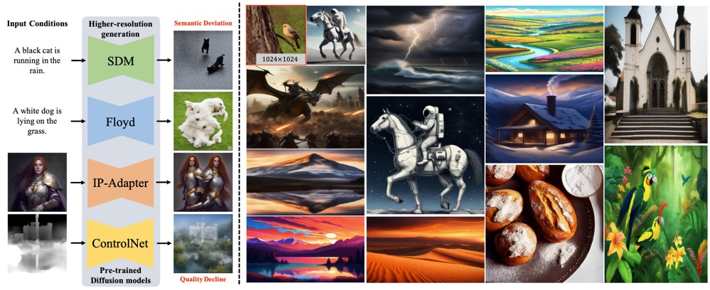

# MegaFusion: Extend Diffusion Models towards Higher-resolution Image Generation without Further Tuning

This repository contains the official PyTorch implementation of MegaFusion: https://arxiv.org/abs/2408.11001/

We are in the process of standardizing and gradually open-sourcing our code in the near future, so please stay tuned.

<div align="center">
   
</div>

## Some Information
[Project Page](https://haoningwu3639.github.io/MegaFusion/)  $\cdot$ [Paper](https://arxiv.org/abs/2408.11001/)

## Requirements
- Python >= 3.8 (Recommend to use [Anaconda](https://www.anaconda.com/download/#linux) or [Miniconda](https://docs.conda.io/en/latest/miniconda.html))
- [PyTorch >= 1.12](https://pytorch.org/)
- xformers == 0.0.13
- diffusers == 0.13.1
- accelerate == 0.17.1
- transformers == 4.27.4

A suitable [conda](https://conda.io/) environment named `megafusion` can be created
and activated with:

```
conda env create -f environment.yaml
conda activate megafusion
```


## Inference
Since our MegaFusion is designed to extend existing diffusion-based text-to-image models towards higher-resolution generation. We provide the offical MegaFusion implementations on several representative models, including StableDiffusion, StableDiffusion-XL, DeepFloyd, ControlNet, and IP-Adapter.

### Inference with SDM-MegaFusion
First, please download pre-trained StableDiffusion-1.5 from [SDM-1.5](https://huggingface.co/runwayml/stable-diffusion-v1-5/). Then, all the pre-trained checkpoints should be placed into the corresponding location in the folder `./SDM-MegaFusion/ckpt/stable-diffusion-v1-5/`.

Run the inference demo with:
```
CUDA_VISIBLE_DEVICES=0 accelerate launch inference.py
```

### Inference with SDXL-MegaFusion
Taking computational overhead into consideration, we only use SDXL-base, and discard SDXL-refiner in our project. First, please download pre-trained StableDiffusion-XL from [SDXL-base](https://huggingface.co/stabilityai/stable-diffusion-xl-base-1.0/). Then, all the pre-trained checkpoints should be placed into the corresponding location in the folder `./SDXL-MegaFusion/ckpt/`.

To be updated soon...

### Inference with Floyd-MegaFusion
Taking computational overhead into consideration, we only use the first two stages of DeepFloyd, and discard the last stage in our project.
First, please download pre-trained DeepFloyd from [SDM](https://huggingface.co/DeepFloyd/IF-I-XL-v1.0/). Then, all the pre-trained checkpoints should be placed into the corresponding location in the folder `./DeepFloyd/ckpt/`.

To be updated soon...

### Inference with ControlNet-MegaFusion
To be updated soon...

### Inference with IP-Adapter-MegaFusion
To be updated soon...


## Evaluation

### Dataset
Our main experiments are conducted on the commonly used MS-COCO dataset, you can download it from [MS-COCO](https://cocodataset.org/#home).

### Sample images
Taking SDM-MegaFusion as an example, you can load the captions, and sample images with them as conditions via:
```
CUDA_VISIBLE_DEVICES=0 accelerate launch synthesize.py
```

### Metrics
We use the commonly used [FID](https://github.com/mseitzer/pytorch-fid) and KID as main evalutaion metrics.
Besides, to quantitatively evaluate the semantic correctness of the synthesized results, we also utilize several language-based scores in our work, including CLIP-T CIDEr, Meteor, and ROUGE.

To be updated soon...

### Caption synthesized images with VLM
In our project, we use a state-of-the-art open-sourced VLM, [MiniGPT-v2](https://github.com/Vision-CAIR/MiniGPT-4) to give a caption for each synthesized image, to further evaluate the semantic correctness of higher-resolution generation.

To be updated soon...

## TODO
- [x] Release Paper
- [x] Complete Bibtex
- [ ] Model Code of SDM-MegaFusion
- [ ] Inference Code of SDM-MegaFusion
- [ ] Image Caption Code of MiniGPT-v2
- [ ] Evaluation Code
- [ ] Model Code of SDXL-MegaFusion
- [ ] Inference Code of SDXL-MegaFusion
- [ ] Model Code of Floyd-MegaFusion
- [ ] Inference Code of Floyd-MegaFusion


## Citation
If you use this code for your research or project, please cite:

	@arxiv{wu2024megafusion,
      title     = {MegaFusion: Extend Diffusion Models towards Higher-resolution Image Generation without Further Tuning}, 
      author    = {Haoning Wu, Shaocheng Shen, Qiang Hu, Xiaoyun Zhang, Ya Zhang, Yanfeng Wang},
      year      = {2024},
      journal   = {arXiv preprint arXiv:2408.11001},
	}

## Acknowledgements
Many thanks to the code bases from [diffusers](https://github.com/huggingface/diffusers), [SimpleSDM](https://github.com/haoningwu3639/SimpleSDM), [SimpleSDXL](https://github.com/haoningwu3639/SimpleSDXL), and [DeepFloyd](https://github.com/deep-floyd/IF).

## Contact
If you have any questions, please feel free to contact haoningwu3639@gmail.com or shenshaocheng@sjtu.edu.cn.
